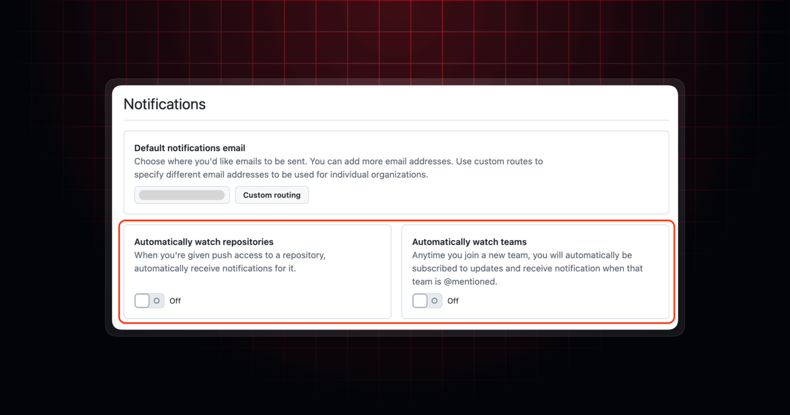
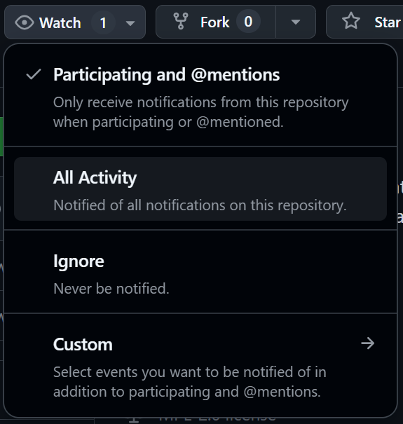

<!--   -->

<h1>
  Auto Watch GitHub Repository
</h1>

  A userscript to automatically watch your repositories and your newly created repositories on GitHub.

[![Pull Requests][github-pr-badge]][github-pr-link]
[![Issues][github-issue-badge]][github-issue-link]
[![License][github-license-badge]](LICENSE)

<!-- Main Body -->

## Introduction
Often forget to watch your repositories, leading to missed notifications on issues and pull requests?

This Tampermonkey script automatically clicks the "Watch" button for you on your GitHub repositories and newly created repositories (including organization repositories you create).

### Why?
On May 23, 2025, GitHub [sunsets automatic watching of repositories and teams](https://github.blog/changelog/2025-05-22-sunset-of-automatic-watching-of-repositories-and-teams). This means that users will no longer have the option to automatically watch repositories they create. This script restores that functionality, enabling you to stay updated with issues, pull requests, and any other activities in your own repositories.

## Features
- **Auto watch repos you own:** When you visit GitHub repositories you own, automatically click the "Watch" button if you are not watching it.
- **Auto watch repos you create in your account and organizations:** Upon repository creating, automatically record the repository you created and click the "Watch" button for you after you are redirected to the newly created repository. Once watched, the record will be removed.

<!-- /Main Body -->

  
[![BACK TO TOP][back-to-top-button]](#readme-top)

---

  Copyright &copy; 2024-present <a target="_blank" href="https://github.com/katorlys">Katorly Lab</a>

[![License][github-license-badge-bottom]](LICENSE)

[back-to-top-button]: https://img.shields.io/badge/BACK_TO_TOP-151515?style=flat-square
[github-pr-badge]: https://img.shields.io/github/issues-pr/katorlys/auto-watch-repository?label=pulls&labelColor=151515&color=79E096&style=flat-square
[github-pr-link]: https://github.com/katorlys/auto-watch-repository/pulls
[github-issue-badge]: https://img.shields.io/github/issues/katorlys/auto-watch-repository?labelColor=151515&color=FFC868&style=flat-square
[github-issue-link]: https://github.com/katorlys/auto-watch-repository/issues
[github-license-badge]: https://img.shields.io/github/license/katorlys/auto-watch-repository?labelColor=151515&color=EFEFEF&style=flat-square
<!-- https://img.shields.io/badge/license-CC_BY--NC--SA_4.0-EFEFEF?labelColor=151515&style=flat-square -->
[github-license-badge-bottom]: https://img.shields.io/github/license/katorlys/auto-watch-repository?labelColor=151515&color=EFEFEF&style=for-the-badge
<!-- https://img.shields.io/badge/license-CC_BY--NC--SA_4.0-EFEFEF?labelColor=151515&style=for-the-badge -->
